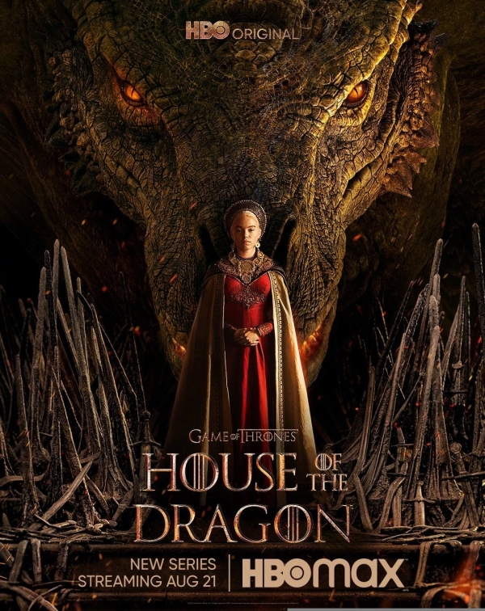

# 美剧记录

!!! success "已经看完"
    
    - [x] 《老友记》(*Friends*) 10季 
    - [x] 《权力的游戏》(*Game of Thrones*) 8季
    - [x] 《龙之家族》(*House of the Dragon*) 2季
    - [x] 《绝命毒师》(*Breaking Bad*) 5季

!!! warning "正在看"

    - [ ] 《生活大爆炸》(*The Big Bang Theory*) 

!!! question "想看"

    - [ ] 《风骚律师》(*Better Call Saul*)
    - [ ] 《小谢尔顿》(*Young Sheldon*)
    - [ ] 《后翼弃兵》(*The Queen's Gambit*)

## 《老友记》(*Friends*)

推荐指数：⭐⭐⭐⭐⭐

《老友记》是一部典型的情景喜剧，一共有十季，每集的时间大约为20分钟左右（但我记得有一集是40多分钟），非常适合平时吃饭的时候用来休闲看，笑点密集，剧情轻松。

这部剧我从高中就在看，现在已经反复看了好几遍了，当吃饭想看点什么但是一时间不知道该看什么的时候，就会选择它，实在是百看不厌。里面的六个主角性格特色塑造的十分鲜明，看起来就像“活生生的人”一样，而不是与某些电影/电视剧中的角色一样，只是一个脸谱化的形象。

真的太爱了！！！

## 《权力的游戏》(*Game of Thrones*)

推荐指数：⭐⭐⭐⭐⭐

《权力的游戏》是一部史诗奇幻剧，一共有八季，每集的时间较长，大约为50-60分钟左右。无可置疑，这部剧在烂尾前绝对称得上是神剧，但烂尾也确实是烂了。不过考虑到其前面的剧集的精彩程度，我还是会极为推荐这部剧！

这里有着广阔的大陆和海洋，还有着众多的家族和人物，围绕着铁王座展开着故事。剧情还是比较复杂的，人物众多，几大家族的关系还有其相对的地理位置可能在刚看的时候一时间无法理清头绪，但是当我们沉浸进去的时候，便会惊叹于其宏大和精彩。不管是从剧情、人物塑造、特效等哪个方面来看，都几乎无可挑剔（烂尾前），如果要问我我对哪一幕剧情影响最深，我甚至于无法回答，因为此时脑中便会闪动着那些画面，我无法评选出谁是最好的，从剧情来说真是高潮迭起。

但不过说到烂尾，我认为主要是烂在了剧情设计上，不同于之前逻辑严密的剧情，最后的结局终究还是令人比较难以信服。实际上，这部剧甚至比其原作《冰与火之歌》的书更早完结，在缺少了原作的支持后，其自创情节烂尾倒也并不令人意外，只是确实有些遗憾。

## 《龙之家族》(*House of the Dragon*)

推荐指数：⭐⭐⭐⭐

《龙之家族》是《权力的游戏》的前传，讲述了坦格利安家族的故事。这部剧目前共有两季，每集的时间大约为50-60分钟左右，据说第三季会在2026年播出。

此部剧和《权力的游戏》类型相同，相对来说剧情并不很复杂，同时节奏有些拖沓，但是整体来说还是值得一看的。

## 《绝命毒师》(*Breaking Bad*)

推荐指数：⭐⭐⭐⭐⭐

《绝命毒师》是一部犯罪剧，一共有五季，每集的时间大约为50分钟左右。坦白来讲，这部剧在刚开始的时候，并没有很吸引我，但是随着剧情的深入，我发现我不自觉地就被吸引了，这个剧里面我认为比较大的特色是对其心理在不同时期状态的刻画，作为内在的“心理”，却很好地被呈现了出来。也是一部非常推荐看的剧！

这部剧主要讲述的是关于“制毒”的一系列事情，在剧情引人入胜的同时，不禁让人有一些后怕，有些东西还是不要去碰比较好。

## To do

正在看，还没看完，感觉<del>理工男可能会有一些共鸣</del>。