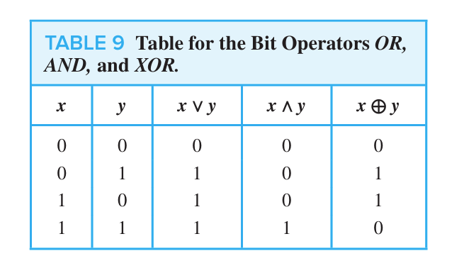
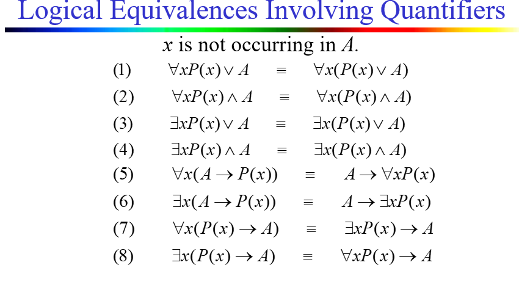
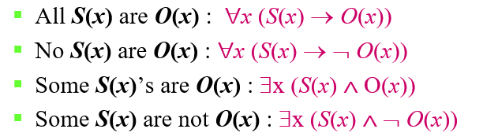

# The Foundations: Logic and Proofs
## 命题逻辑 (Propositional Logic)
### 命题 (Propositions)

- 定义：命题是一个陈述句，其值为真或假，但不同时为真和假；

!!! example

    $x+1=2$不是一个命题，不确定其值到底为真或假；但倘若给定$x$的值，则其必为真或假，从而构成一个命题。

- 命题符号：$p, q, r, \cdots$；
- 原子命题 (atomic propositions)：不可再分的命题；
- 复合命题 (compound propositions)：由已知命题通过逻辑运算符构成的命题；
- 逻辑运算符 (logical operators/ connectives)：如下表；

| 逻辑运算符 | 符号 | 读法 | 优先级 (presedence) |
| :---: | :---: | :---: | :---: |
| 否定 (negation) | $\neg$ | 非 (not) | 1 |
| 合取 (conjunction) | $\land$ | 与 (and) | 2 |
| 析取 (disjunction) | $\lor$ | 或 (or) | 3 |
| 异或 (exclusive or) | $\oplus$ | 或且非 (xor) | / |
| 条件 (conditional) | $\rightarrow$ | 如果...则... (if...then...) | 4 |
| 双条件 (biconditional) | $\leftrightarrow$ | 当且仅当 (if and only if) | 5 |

???+ note "注明"
    
    - conjunction: 全真才为真；
    - disjunction (inclusive or): 全假才为假；
    - exclusive or: 有且仅有一个为真时才真；A student can have soup **or** salad, **but not both**；

### 条件语句 (Conditional Statements)

- 条件语句 (conditional statements or implication)：$p \rightarrow q$；
  - $p$为假设 (hypothesis/antecedent/premise)，$q$为结论 (conclusion/consequence)；
  - 若$p$为真，$q$为假，则条件语句为假；其余情况均为真

??? note "多种表达"

    - if $p$, then $q$；
    - $p$ implies $q$；
    - if $p$, $q$；
    - **$p$ only if $q$**（不要搞混了）；
    - $q$ if $p$；
    - $q$ when $p$；
    - $q$ whenever $p$；
    - $q$ follows from $p$；
    - $q$ is a necessary condition for $p$；
    - $p$ is a sufficient condition for $q$；
    - $q$ unless $\neg p$；

- 逆命题 (converse)：$q \rightarrow p$；
- 反命题 (inverse)：$\neg p \rightarrow \neg q$；
- 逆否命题 (contrapositive)：$\neg q \rightarrow \neg p$；
- 双条件语句 (biconditional statements/bi-implications)：$p \leftrightarrow q$，"$p$ and only if (iff) $q$"，$p$当且仅当$q$，即为 $(p \rightarrow q) \land (q \rightarrow p)$；

    ??? note "多种表达"

        - $p$ if and only if $q$；
        - $p$ is equivalent to $q$；
        - $p$ is necessary and sufficient for $q$；
        - $p$ iff $q$；
        - if $p$, then $q$ and conversely；
        - $p$ exactly when $q$；

### 逻辑运算和比特运算 (Logic and Bit Operations)

- 布尔变量 (Boolean variables)：只能取两个值，0和1，分别对应假和真；

## 命题逻辑的应用 (Applications of Propositional Logic)

是一些各方面的应用，在这里就不展开具体阐述了~

## 命题等价式 (Propositional Equivalences)
### 复合命题的分类 (Classification of Compound Propositions)

- 永真式 (tautology)：恒为真的复合命题；
- 矛盾式 (contradiction)：恒为假的复合命题；
- 可能式 (contingency)：既非永真式也非矛盾式的复合命题；

??? example

    

### 逻辑等价式 (Logical Equivalences)

- 逻辑等价式 (logical equivalence)：$p \leftrightarrow q$是一个永真式，记为$p \equiv q$；

??? note "注"

    符号$\equiv$不是逻辑运算符，$p \equiv q$不是一个复合命题，而是表示$p \leftrightarrow q$是永真式；

为了说明两命题等价，可以通过真值表 (truth table)，但是比较耗时，所以我们可以使用一些已经证明的等价式来简化：

| 中文名称 | 英文名称 | 等价式 |
| :---: | :---: | :---: |
| 同一律 | Identity laws | $p \land T \equiv p$ $p \lor F \equiv p$ |
| 零律 | Domination laws | $p \lor T \equiv T$ $p \land F \equiv F$ |
| 吸收律 | Idempotent laws | $p \lor p \equiv p$ $p \land p \equiv p$ |
| 幂等律 | Absorption laws | $p \lor (p \land q) \equiv p$ $p \land (p \lor q) \equiv p$ |
| 双重否定律 | Double negation laws | $\neg (\neg p) \equiv p$ |
| **德摩根定律** | De Morgan's laws | $\neg (p \land q) \equiv \neg p \lor \neg q$ $\neg (p \lor q) \equiv \neg p \land \neg q$ |
| 分配律 | Distribution laws | $p \land (q \lor r) \equiv (p \land q) \lor (p \land r)$ $p \lor (q \land r) \equiv (p \lor q) \land (p \lor r)$ |
| 结合律 | Associative laws | $(p \land q) \land r \equiv p \land (q \land r)$ $(p \lor q) \lor r \equiv p \lor (q \lor r)$ |
| 交换律 | Commutative laws | $p \land q \equiv q \land p$ $p \lor q \equiv q \lor p$ |
| 否定律 | Negation laws | $p \land \neg p \equiv F$ $p \lor \neg p \equiv T$ |
| **蕴含律** | Implication laws | $p \rightarrow q \equiv \neg p \lor q$ |
| **等价律** | Equivalence laws | $p \leftrightarrow q \equiv (p \rightarrow q) \land (q \rightarrow p)$ |

其中，德摩根定律可以扩展为$n$个命题的情况：

$$
\neg (p_1 \land p_2 \land \cdots \land p_n) \equiv \neg p_1 \lor \neg p_2 \lor \cdots \lor \neg p_n
$$

可以用简洁的方式表示为：

$$
\neg \left( \bigwedge_{i=1}^n p_i \right) \equiv \bigvee_{i=1}^n \neg p_i
$$

### 可满足性 (Satisfiability)

- 可满足 (satisfiable)：存在至少一种赋值使得复合命题为真；
  - 当我们找到一个特定的使得复合命题为真的赋值时，我们称其为一个解 (solution)；
- 不可满足 (unsatisfiable)：所有赋值都使得复合命题为假；
  - 一个复合命题不可满足时，当且仅当其否定为永真式；

## 谓词和量词 (Predicates and Quantifiers)
### 谓词 (Predicates)

- 谓词 (predicate)：一个函数，其输入是一个或多个值，输出是一个命题；
  - 谓词符号：$P, Q, R, \cdots$；
  - 谓词变元 (predicate variables)：$x, y, z, \cdots$；
  - 谓词公式 (predicate formula)：$P(x)$；
  - 涉及 n 个变元的谓词称为 n 元谓词 (n-ary/ n-place predicate)；

### 量词 (Quantifiers)

- 量词 (quantifier)：用于描述谓词的范围；
  - 全称量词 (universal quantifier)：$\forall$，表示对所有的；
  - 存在量词 (existential quantifier)：$\exists$，表示存在一个；
- 谓词演算 (predicate calculus)：使用谓词和量词的逻辑系统；

#### 全称量词 (Universal Quantifier)

- "$p(x)$ for all values of $x$ in the domain"，记为$\forall x p(x)$，读作"for all $x, p(x)$"；
- 论域 (domain of discourse/universe of discourse)：谓词变元的取值范围；
- 反例 (counterexample)：用于证明全称量词的否定；

??? note "多种表达"

    - for all;
    - for every;
    - for each;
    - **for any**;
    - all of;
    - given any;
    - for arbitrary;

#### 存在量词 (Existential Quantifier)

- "$p(x)$ for some values of $x$ in the domain"，记为$\exists x p(x)$，读作"for some $x$ $p(x)$"；

??? note "多种表达"

    - there is an $x$ such that $p(x)$;
    - there is at least one $x$ such that $p(x)$;

### 唯一性量词 (Uniqueness Quantifier)

- 唯一性量词 (uniqueness quantifier)：$\exists !$，表示存在且唯一使得其为真；
- 由于其可以被全称量词和存在量词表示，所以平时可以不用；

### 受限域的量词 (Restricted Quantifiers)

- $\forall x<0(x^2>0)$ 与 $\forall x(x<0 \rightarrow x^2>0)$等价，受限的全称量化和一个条件语句的全称量化等价；
- $\exists z>0(z^2=2)$ 与 $\exists z(z>0 \land z^2=2)$等价，受限的存在量化和一个合取的存在量化等价；
### 量词的优先级 (Precedence of Quantifiers)

- 量词的优先级：$\forall$ 和 $\exists$ 比逻辑运算符具有更高的优先级；

### 变量绑定 (Binding Variables)

- 量词绑定 (binding variables)：量词限定了变量的范围；
  - 命题函数中的所有变量出现必须是被约束的或是等于某个特定值的；
- 自由变量 (free variables)：未被量词限定的变量；

### 涉及量词的逻辑等价式 (Logical Equivalences Involving Quantifiers)

- $\forall x p(x) \land \forall x q(x) \equiv \forall x (p(x) \land q(x))$；
- $\exists x p(x) \lor \exists x q(x) \equiv \exists x (p(x) \lor q(x))$；

??? note "注意"

    - $\forall x p(x) \lor \forall x q(x) \neq \forall x (p(x) \lor q(x))$；
    - $\exists x p(x) \land \exists x q(x) \neq \exists x (p(x) \land q(x))$；

- 带量词的德摩根定律：
    - $\neg \forall x p(x) \equiv \exists x \neg p(x)$；
    - $\neg \exists x p(x) \equiv \forall x \neg p(x)$；

??? note "注意"

    注意后面四个式子前后顺序不同导致的差别。

### 文本翻译 (Translating Statements)

!!! tip

    

## Nested Quantifiers

## Rules of Inference

## Introduction to Proofs

## Proof Methods and Strategy