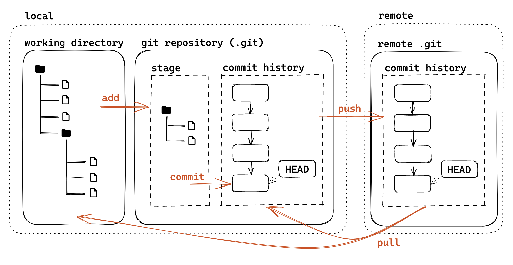
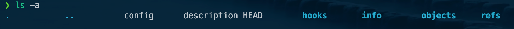
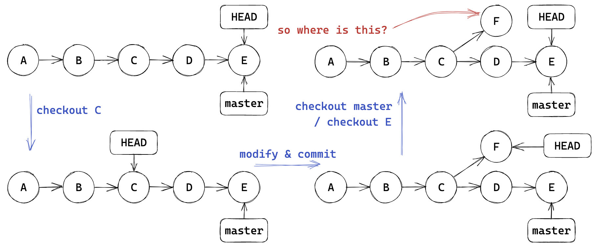
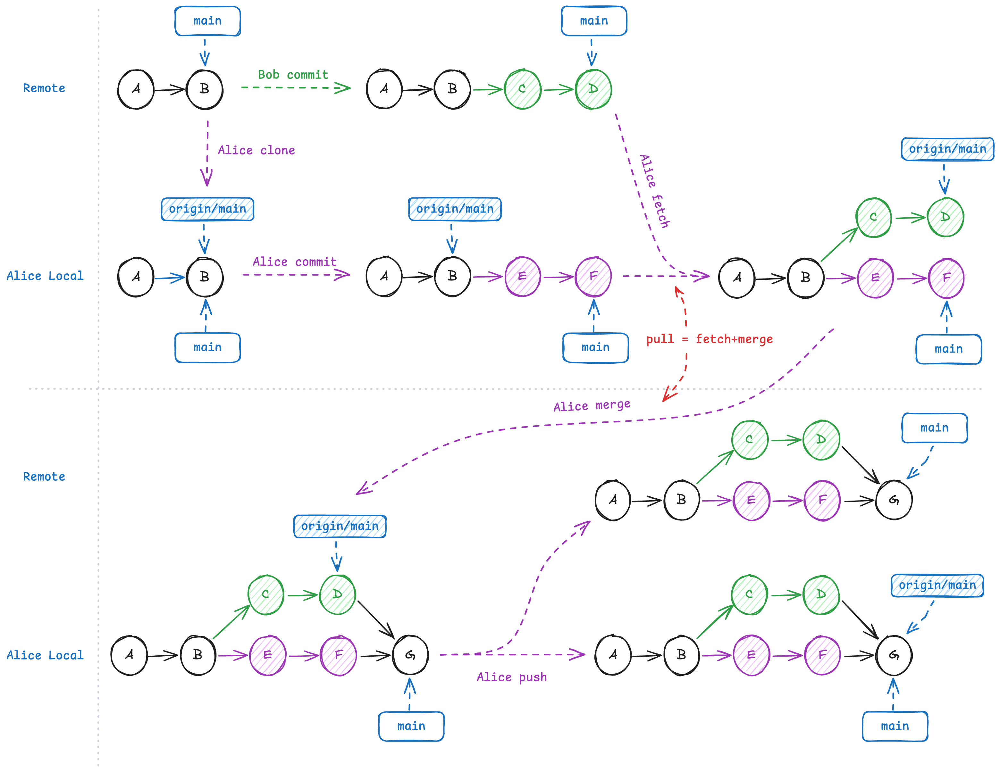
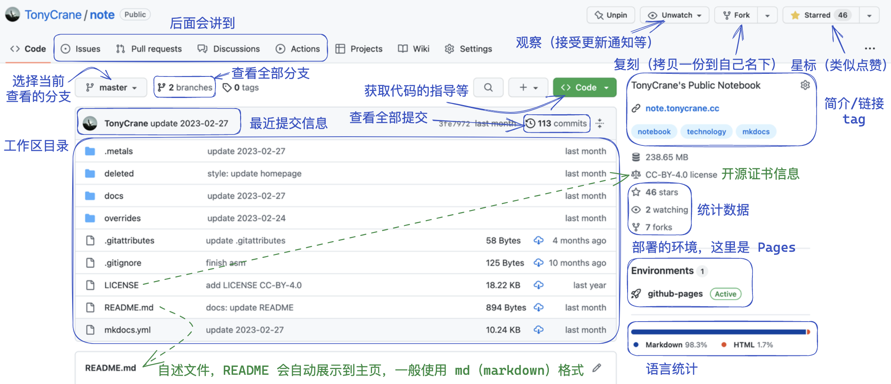
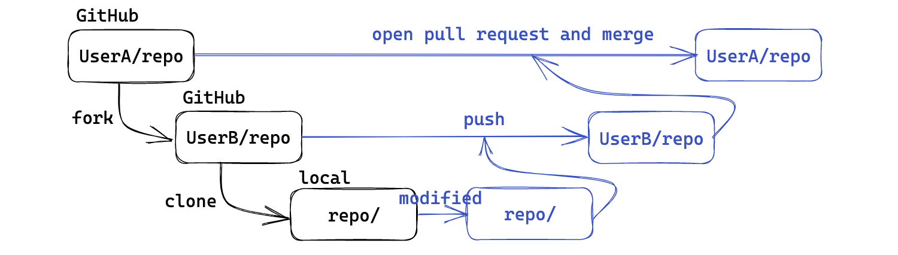

# Git & GitHub
## Git 介绍
### 什么是 Git
#### 简介

Git 是一个强大的 **分布式版本控制系统 (DVCS, Distributed Version Control System)**。

- 分布式：不需要联网，在自己的机器上就可以使用；
- 版本控制：记录、管理、回溯文件的修改历史；
- 方便进行团队协作，让多人高效地在同一个项目上工作；

#### Git 工作流模型



我们从底向上来理解，可以看到，主要有以下三个部分：

- 工作区：就是你本地的文件夹，包含了所有的文件和文件夹；
- 本地仓库：就是你本地的 `.git` 文件夹，包含了项目版本历史；
  - 暂存区：一个临时区域，用来存放你准备提交的文件修改；
  - 提交历史：提交历史版本查看和管理；
- 远程仓库：托管在网络服务器（如 GitHub, Gitee, ZJU git）上的项目版本历史，用于备份和协作。

### Git 配置

对于 Git 的安装，若是 MacOS 和 Linux 系统，大部分都是自带的，如果没有，可以直接使用包管理器安装；Windows 系统可以使用 [Git for Windows](https://gitforwindows.org/){target="_blank"} 来安装。

对于 Git 的配置，主要是设置用户名和邮箱，这两个信息会在每次提交时记录在版本历史中。

```bash
git config --global user.name "Your Name"
git config --global user.email "Your Email"
```

可以使用 `git config --global --list` 来查看当前的配置。

另外，特别要说明的是，我们有时候会有代理的需求，这就需要我们在其配置中设置代理，设置后其就能走我们所设置的代理，有时候速度会更快。一般来说，要么在 `.gitconfig` 文件中设置，要么在命令行中设置，下面给出命令行设置的一些指令。

```bash
git config --global http.proxy http://proxy-server:port
git config --global https.proxy https://proxy-server:port
```

这里的 `proxy-server` 和 `port` 分别是代理服务器的地址和端口号。

如果你使用的是 SOCKS 代理，可以使用以下命令：

```bash
git config --global http.proxy socks5://proxy-server:port
git config --global https.proxy socks5://proxy-server:port
```

如果需要取消代理，可以使用以下命令：

```bash
git config --global --unset http.proxy
git config --global --unset https.proxy
```

同样的，上述配置都可以用 `git config --global -l` 来查看。如果不想要对全局进行设置，那么可以去掉 `--global` 选项，其余的不变，这样就只会对当前特定的仓库进行设置。

### 基础用法

> 碎碎念：Git 的完整用法很多，命令很多，但是常用的一般就是那么几个，所以我认为只要对常用的命令有一个理解，用着用着就熟悉了；对于使用频率没那么高的一些命令，我们大可以边用边查。

#### 初始化仓库

首先我们需要初始化一个本地仓库，使用 `git init` 命令来完成。

```bash
mkdir try_git
cd try_git
git init
```

初始化后，这个仓库就会被 Git 所管理，可以看到，其现在在 `main` 上。


我们会有一个 `.git` 文件夹来对这个仓库进行版本控制管理，记录这些相关信息。

> 注意：`.git` 文件夹是系统不希望我们去看见和更改的文件夹，所以我们在使用 `ls` 命令时是看不见的；如果想要查看，可以使用 `ls -a` 命令来查看。



#### 添加文件

现在我们可以新建一个文件，比如 `hello.c` 文件，我们可以先看一下文件的状态。使用 `git status` 命令来查看当前仓库的状态。其输出如下：

```bash
On branch main
No commits yet
Untracked files:
  (use "git add <file>..." to include in what will be committed)

  hello.c
nothing added to commit but untracked files present (use "git add" to track)
```

也就是说现在这个文件是 **Untracked** 的状态，表示这个文件没有被 Git 所管理，根据其输出提示，我们可以使用 `git add` 命令来将其添加到 Git 的管理中。

同时，我们在 VSCode 中也可以看见相关的小标识 `U`。


那么接下来，我们就可以使用 `git add` 命令来将其添加到 Git 的管理中。

```bash
git add hello.c
```
> 如果我们要取消一个新文件的暂存，可以使用 `git rm --cached <file>` 命令来完成。

#### 提交更改

接下来，我们需要提交这个文件的更改信息，使用 `git commit` 命令来完成。具体来说：

```bash
git commit -m "feat: add hello.c"
```
这里的 `-m` 参数表示我们要添加一个提交信息，后面的字符串就是我们要添加的提交信息。

!!! note "注意"

    这里提交的信息是需要一些规范的，大致来说，可以使用 `<type>(<scope>): <subject>` 的格式来进行提交信息的书写。
    其中，`<type>` 表示提交的类型，比如 `feat`、`fix`、`docs` 等等；`<scope>` 表示提交的范围，比如 `core`、`ui` 等等；`<subject>` 表示提交的主题，比如 `add hello.c`。
    
    进行规范的意图是为了让我们在查看提交历史时，能够快速地了解每次做出相关修改的一些信息，便于我们进行控制和合作。

在我们提交之后，会有一个标识符 `commit id` 来标识这个提交，这个提交 id 是一个 `SHA-1` 哈希值，我们可以使用前几位来代表这次提交。使用 `git show <commit id>` 命令可以查看这次提交的详细信息。

我们可以使用 `git log` 命令来查看提交历史，同时，此命令还有一些额外可以添加的参数来帮助我们更好地查看。比如有：

- `--oneline`：以单行的形式查看提交历史；
- `--graph`：显示分支结构；
- `--all`：查看所有的提交历史；

此外，还需要我们注意的有 `git diff <A> <B>` 命令，这里的 `<A>` 和 `<B>` 可以是提交 id，也可以是分支名，文件名等，表示我们要查看这两个东西之间的差异。直接 使用 `git diff` 命令可以查看当前工作区和暂存区之间的差异。

#### 分支管理

分支是 Git 的一个重要特性，它允许我们在同一个仓库中进行多条线的开发。下面介绍一系列的分支管理命令。

- 创建分支
  - `git branch <branch_name>`：创建一个新的分支，基于当前 `head` 所在位置；
  - `git branch <branch_name> <commit_id>`：创建一个新的分支，基于指定的提交 id 所在位置；
- 查看分支
  - `git branch`：查看当前的分支情况；
  - `git branch -a`：查看所有的分支情况，包括远程分支；
  - `git show branch`：更详细的分支情况；
- 切换分支（检出）
  - `git checkout <branch_name>`：切换到指定的分支；
  - `git checkout -b <branch_name>`：创建一个新的分支并切换到这个分支；

!!! note "关于 checkout"

    对于这个命令，我们需要特别注意一些事情，主要是 *Detached HEAD* 的问题。当我们使用 `git checkout <commit_id>` 这个命令的时候，就会出现这个问题。如下图所示，大家可以比较直观地理解到这个事情。

    

    所以说，`git checkout <commit_id>` 这个命令，我们通常用它来查看旧版本，一般不直接在此基础上直接修改提交。
    
    如果我们希望在这个基础上进行修改提交，我们可以回到这个旧版本的时候，再使用 `git checkout -b <branch_name>` 来创建一个新的分支，这样就不会出现 *Detached HEAD* 的问题了。

- 删除分支
  - `git branch -d <branch_name>`：删除指定的分支；
  - ``git branch -D <branch_name>``：强制删除指定的分支；
- 合并分支
  - `git merge <branch_name>`：将指定的分支合并到当前分支；
  - 如果有冲突，会提示我们进行解决，需要手动处理冲突，解决完后需要使用 `git add` 命令来将其添加到暂存区，然后使用 `git commit` 命令来提交；

#### 一些其他命令

- 修改提交历史
  1. `git revert <commit_id>`：撤销指定的提交，生成一个新的提交（此次更改的补集），但历史的提交不变；
  2. `git commit --amend`：修改上一次提交的提交信息；
  3. `git reset <commit_id>`：回到之前某一提交；
     - `git reset --hard <commit_id>`：修改 `HEAD` 指针，暂存区和工作区（完全回退）；
     - `git reset --soft <commit_id>`：只修改 `HEAD` 指针，保留工作区和暂存区的修改；
     - `git reset --mixed <commit_id>`：修改 `HEAD` 指针和暂存区，保留工作区的修改（默认）；
  
??? tip "AI 解释"

    下面附上一段 AI 解释的文字，供大家参考。  

    `git reset` 命令用于将当前分支的 HEAD 指针移动到指定的提交，同时根据不同的模式，它还会影响暂存区和工作区的内容。以下是三种主要模式的详细讲解：

    1. **`git reset --soft <commit_id>`**
      - **HEAD 指针**：移动到指定的 `<commit_id>`。这意味着你之后的提交历史在 `git log` 中将不再可见（除非你切换到其他包含这些提交的分支）。
      - **暂存区 (Index)**：**保持不变**。也就是说，在 `<commit_id>` 和你原来 `HEAD` 位置之间的所有更改，现在都会出现在暂存区中，显示为“Changes to be committed”。
      - **工作区 (Working Directory)**：**保持不变**。你本地文件的内容不会有任何变化。
      - **用途**：当你提交后发现提交信息有误，或者想把最近的几次提交合并成一个新的提交时，这个模式非常有用。你可以回退 `HEAD`，然后重新 `git commit` 并附上新的提交信息或合并内容。

    2. **`git reset --mixed <commit_id>` (这是默认模式)**
      - **HEAD 指针**：移动到指定的 `<commit_id>`。
      - **暂存区 (Index)**：**被重置**。暂存区的内容会更新为 `<commit_id>` 所指向的快照。也就是说，在 `<commit_id>` 和你原来 `HEAD` 位置之间的所有更改，现在都会从暂存区移出，显示为工作区中的“Changes not staged for commit”（未暂存的更改）。
      - **工作区 (Working Directory)**：**保持不变**。你本地文件的内容不会有任何变化，但这些更改现在是未暂存状态。
      - **用途**：当你提交后，发现有些更改不应该包含在内，或者想重新组织暂存区的内容时使用。它会保留工作目录的更改，但撤销了 `git add` 的操作，允许你重新选择要暂存和提交的文件。

    3. **`git reset --hard <commit_id>`**
      - **HEAD 指针**：移动到指定的 `<commit_id>`。
      - **暂存区 (Index)**：**被重置**。暂存区的内容会更新为 `<commit_id>` 所指向的快照。
      - **工作区 (Working Directory)**：**被重置**。工作区的文件内容会完全恢复到 `<commit_id>` 时的状态。**这意味着所有在 `<commit_id>` 之后所做的更改（无论是已暂存还是未暂存的）都会丢失！**
      - **用途**：当你确定要彻底丢弃某次提交之后的所有本地更改时使用。这是一个具有破坏性的操作，因为工作区的更改会丢失且通常无法恢复（除非你有其他备份或通过 `git reflog` 尝试恢复，但这并不总是可行）。**请谨慎使用此命令。**

    总结来说：
      - `--soft`：只动 `HEAD`。
      - `--mixed`：动 `HEAD` 和暂存区。
      - `--hard`：动 `HEAD`、暂存区和工作区。

    在使用 `git reset` 时，特别是 `--hard` 模式，请确保你清楚其后果，因为它可能会导致数据丢失。

### .gitignore 文件

`.gitignore` 文件是一个文本文件，用于告诉 Git 哪些文件或目录应该被忽略，不进行版本控制。它通常位于项目的根目录下。

在 `.gitignore` 文件中，我们可以使用一些通配符来匹配文件和目录，比如：

- `*`：匹配任意字符；
- `**`：匹配中间目录，例如 `a/**/b` 匹配 `a/b`、`a/x/b`、`a/x/y/b` 等；
- `/`：开头只匹配根目录，否则匹配任意目录；
- `!`：表示不忽略；
- `#`：表示注释；

### VSCode 集成 Git

我们在前面已经简单地看过一些 VSCode 集成 Git 的功能了，这里我们再简单地介绍一下。

- 版本控制：在左侧的活动栏中，点击 `Source Control` 图标，可以查看当前的版本控制状态，里面提供了比较直观的图形化界面，里面集成了非常多的功能，方便我们进行管理操作；
  - 提交：在 `Source Control` 中，可以直接进行提交操作；
  - 分支管理：在 `Source Control` 中，可以直接进行分支的创建、切换、删除等操作；
  - 比较差异：我们可以直观看到具体什么地方产生了变动；
  - ...
- 在工作区，每一个文件的状态会有相关的颜色和标识，来表明此时这个文件所处的状态
- 在文件内部，也会有相应的一些颜色标识在行号右面，来注明到底是什么地方进行了修改，比如有绿色实线表示新增的行，蓝色虚线表示修改的行等。
- 此外，还可以使用 **GitLens** 插件来增强 VSCode 的 Git 功能，提供了更多的功能，可以具体看到每一行的修改历史、作者、时间等信息，方便我们进行版本控制和协作开发。

## Github 介绍
### 远程版本库

我们如何用 Git 来实现多人合作呢？这就需要我们使用远程版本库了。远程版本库是一个托管在网络上的 Git 仓库，允许多个开发者进行协作开发，来实现同步协作功能。那么 Github 就是我们最常用的远程版本库之一。

远程版本库也是一个普通的 Git 版本库，可以简单理解为本地的一个 `origin/main` 分支。我们可以使用 `git remote` 命令来查看远程版本库的情况。

- `git clone <SRC> <DEST>`：克隆远程版本库到本地，会自动建立 remote 和 local 的关联，可以通过 `git remote` 来管理；
- `git push`：将本地的提交推送到远程版本库；
- `git pull`：从远程版本库拉取最新的提交到本地，等价于 `fetch` + `merge`；



我们可以使用 `ssh` 协议来连接远程版本库，这里就不再多说了。

### GitHub 简介

Github 是一个基于 Git 的代码托管平台，提供了 Git 的远程版本库服务。它允许我们将本地的 Git 仓库推送到远程仓库，并且可以从远程仓库拉取代码到本地。同时，它也是全球最大的代码托管平台，拥有大量的开源项目和开发者。

关于 github 的 repo，可以看下面的图片：



- issues:
  - 用于记录项目中的 bug 和功能请求，也可以寻求帮助并进行讨论；
  - 一般使用 markdown 语言来书写；
- pull requests:
  - 用于提交代码的请求，可以进行代码审查和讨论，来更好地构建这个项目；

进行协作一般的流程为：



## 开源项目基础
### 许可证

常见软件开源许可证有：

- MIT：最宽松的开源许可证，允许任何人使用、修改和分发代码；
- Apache 2.0：允许使用、修改和分发代码，但要求保留原作者的版权声明和许可证；
- GPL：要求任何修改后的代码也必须开源，并且使用相同的许可证；
- ...

还有知识共享类（Creative Commons）许可证，主要用于非软件类的开源项目，比如文档、图片等。

- CC BY：允许使用、修改和分发代码，但要求保留原作者的版权声明；
- CC BY-SA：允许使用、修改和分发代码，但要求保留原作者的版权声明，并且使用相同的许可证；
- CC BY-NC：允许使用、修改和分发代码，但要求保留原作者的版权声明，并且不能用于商业用途；
- CC BY-NC-SA：允许使用、修改和分发代码，但要求保留原作者的版权声明，并且不能用于商业用途，并且使用相同的许可证；
- CC BY-ND：允许使用代码，但要求保留原作者的版权声明，并且不能分发和修改代码；
- CC 0：放弃所有版权，允许任何人使用、修改和分发代码；

## 参考资料

- [xg 的 PPT](https://slides.tonycrane.cc/PracticalSkillsTutorial/2023-spring-cs/lec2/#/){target="_blank"}；
- [辅学计划讲义](https://ckc-agc.bowling233.top/programming/24fall/lec3/){target="_blank"}；
- [Pro Git](https://git-scm.com/book/zh/v2){target="_blank"}；